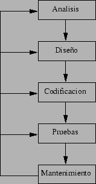
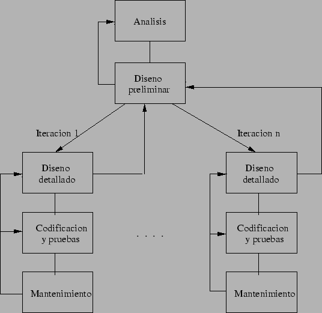
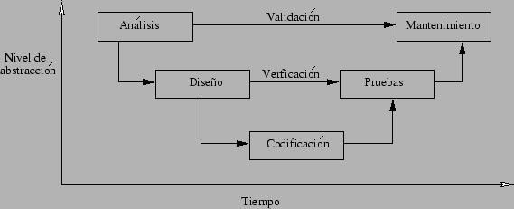
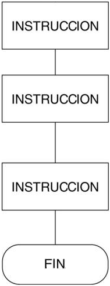
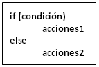
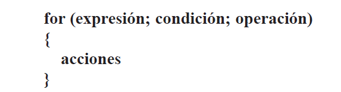
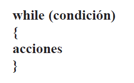

# Base de la ingeniería del software

## Índice de contenidos
|[Conceptos generales](#conceptos-generales)                          |[Ciclo de vida del software y Tipos de Metodologías](#ciclo-de-vida-del-software-y-tipos-de-metodologías)|[Ingeniería estructurada](#ingeniería-del-software-estructurada)|
|---                                                                  |---                                                                                                      |---
|[Especificación](#especificación)                                    |[En cascada (waterfall)](#en-cascada-waterfall)                                                          |[Estructura secuencial](#estructura-secuencial)
|[Diseño](#diseño)                                                    |[Iterativo](#iterativo)                                                                                  |[Estructura condicionales](#estructura-condicionales)
|[Construcción](#construcción)                                        |[En V](#en-v)                                                                                            |[Estructuras de repetición (bucles)](#estructuras-de-repetición-bucles)
|[Validación,verificación,pruebas](#validación-verificación-y-pruebas)|[Basado en componentes (CBSE)](#basado-en-componentes-cbse)                                              |[Bucle for](#for)
|                                                                     |[Desarrollo rápido (RAD)](#desarrollo-rápido-rad)                                                        |[Bucle while](#while)

## Conceptos generales:
- Especificación
- Diseño
- Construcción
- Validación, verificación y pruebas:
- Mantenimiento

[Ir al indice](#top)

### Especificación
Es la tarea de escribir detalladamente el software a ser desarrollado, en una forma matemáticamente rigurosa. En la realidad, la
mayoría de las buenas especificaciones han sido escritas para entender y afinar aplicaciones que ya estaban desarrolladas. Las
especificaciones son más importantes para las interfaces externas, que deben permanecer estables.

[Ir al indice](#top)

### Diseño
Se refiere a determinar cómo funcionará el software de forma general sin entrar en detalles. Consisten en incorporar
consideraciones de la implementación tecnológica, como el hardware, la red, etc. Se definen los casos de uso para cubrir las
funciones que realizará el sistema, y se transformarán las entidades definidas en el análisis de requisitos en clases de diseño,
obteniendo un modelo cercano a la programación orientada a objetos.

Extraer los requisitos y requerimientos de un producto de software es la primera etapa para crearlo. El resultado del análisis de 
requerimientos con el cliente se plasma en el [documento ERS](https://es.wikipedia.org/wiki/Especificaci%C3%B3n_de_requisitos_de_software#:~:text=La%20especificaci%C3%B3n%20de%20requisitos%20de,son%20conocidos%20como%20requisitos%20funcionales.),
cuya estructura puede venir definida por varios estándares, tales como [CMMI](https://normasyestandaresproyectosti.wordpress.com/2015/01/29/cmmi/).
Asimismo, se define un diagrama de Entidad/Relación, en el que se plasman las principales entidades que participarán en el 
desarrollo del software.

La captura, análisis y especificación de requerimientos (incluso pruebas de ellos), es una parte crucial; de esta etapa depende en
gran medida el logro de los objetivos finales.

[La IEEE Std. 830-1998](https://www.ctr.unican.es/asignaturas/is1/IEEE830_esp.pdf) normaliza la creación de las especificaciones 
de requerimientos de software.

[Ir al indice](#top)

### Construcción
Traducir un diseño a código puede ser la parte más obvia del trabajo de ingeniería del software, pero no necesariamente es la
que demanda mayor trabajo ni la más complicada. La complejidad y la duración de esta etapa está íntimamente relacionada al o a
los lenguajes de programación utilizados, así como al diseño previamente realizado.

[Ir al indice](#top)

### Validación, verificación y pruebas:
Consiste en comprobar que el software realice correctamente las tareas indicadas en la especificación del problema. Una técnica
de prueba es probar por separado cada módulo del software, y luego probarlo de forma integral, para así llegar al objetivo.

Se recomienda que las pruebas sean efectuadas por alguien distinto al desarrollador que la programó, idealmente un área de pruebas 
aunque el programador debe hacer sus propias pruebas.

En general hay dos grandes formas de organizar un área de pruebas:

1. que esté compuesta por personal inexperto, de esta forma se evalúa que la documentación entregada pueda entenderla cualquiera 
y comprobar que el software hace las cosas tal y como están descritas.

2. es tener un área de pruebas conformada por programadores con experiencia y poner atención en condiciones que puede fallar en la aplicación. 

[Ir al indice](#top)

### Mantenimiento
Mantener y mejorar el software para solventar errores descubiertos y tratar con nuevos requisitos. El mantenimiento puede ser
de cuatro tipos: 

1. perfectivo: mejorar la calidad interna de los sistemas.

2. evolutivo: incorporaciones, modificaciones y eliminaciones necesarias en un producto software para cubrir la expansión o cambio 
en las necesidades del usuario. 

3. adaptativo: modificaciones que afectan a los entornos en los que el sistema opera, por ejemplo, cambios de configuración del hardware.

4. preventivo: revisión constante del software para detectar posibles fuentes de problemas que puedan surgir en el futuro.

[Ir al indice](#top)

## Ciclo de vida del software y Tipos de Metodologías
El ciclo del vida del software es una estructura aplicada al desarrollo de un producto de software. Hay varios modelos a seguir
para el establecimiento de un proceso para el desarrollo de software, cada uno de los cuales describe un enfoque diferente para
diferentes actividades que tienen lugar durante el proceso. Algunos autores consideran un modelo de ciclo de vida un término más
general que un determinado proceso para el desarrollo de software. Por ejemplo, hay varios procesos de desarrollo de software
específicos que se ajustan a un modelo de ciclo de vida de espiral.

Las metodologías de ingeniería software se propusieron con la finalidad de establecer unos pasos a la hora de desarrollar un
programa de forma que evitara, en la medida de lo posible, que el software se volviera inviable de desarrollar a mitad del proceso.

[Ir al indice](#top)

### En cascada (waterfall)
El ciclo de vida inicialmente propuesto por Royce en 1970, fue adaptado para el software a partir de ciclos de vida de otras
ramas de la ingeniería. Es el primero de los propuestos y el más ampliamente seguido por las organizaciones (se estima que el
90% de los sistemas han sido desarrollados así).

Este modelo admite la posibilidad de hacer iteraciones, por ejemplo; durante las modificaciones que se hacen en el mantenimiento se 
puede ver la necesidad de cambiar algo en el diseño, lo cual significa que se harán los cambios necesarios en la codificación y se 
tendrán que realizar de nuevo las pruebas y así hasta recorrer de nuevo el resto de las etapas comprobando si se puede pasar a la siguiente. 

Trabaja en base a documentos, es decir, la entrada y la salida de cada estapa es un tipo de documento específico. Idealmente,
cada estapa podría hacerla un equipo diferente. Los documentos son:

- Análisis: toma como entrada una descripción en lenguaje natural de lo que quiere el cliente. Produce el S.R.D. (Software
Requirements Document).

- Diseño: su entrada es el S.R.D. Produce el S.D.D. (Software Design Document)

- Codificación: a partir del S.D.D. produce módulos. En esta fase se hacen también pruebas de unidad.

- Pruebas: a partir de los módulos probados se realiza la integración y pruebas de todo el sistema. El resultado es el producto final.

##### Tipos de proyectos para los que es adecuado
- Aquellos para los que se dispone de todas las especificaciones desde el principio, por ejemplo, los de reingeniería.

- Se está desarrollando un tipo de producto que no es novedoso.

- Proyectos complejos que se entienden bien desde el principio

> [ventajas y desventajas](https://sites.google.com/site/proyectoadpmodelosdedesarrollo/home/modelo-en-cascada/modelo-en-cascada-ventajas-y-desventajas) 

[Ir al indice](#top)

### Iterativo
Para entender los requisitos antes de entregar el producto se puede hacer un desarrollo iterativo durante las fases de análisis y 
diseño global. Esto consistiría en:

1. Preguntar al usuario.
2. Hacer el diseño global que se desprende del punto anterior.
3. Hacer un prototipo de interfaz de usuario, entrevistas con los usuarios, etc y volver con ello al primer punto para identificar más
requisitos o corregir malentendidos.

El resto es igual al ciclo de vida en cascada

[Ir al indice](#top)

### Incremental
En este caso se va creando el sistema añadiendo pequeñas funcionalidades. Cada uno de los pequeños incrementos es parecido
a lo que ocurre dentro de la fase de mantenimiento.

Hay dos partes en el ciclo de vida, similares al [Iterativo](#iteratico). Por un lado está el análisis y el diseño global. 
Por otra parte están los pequeños incrementos, con las fases de diseño detallado, codificación y mantenimiento.

>  La ventaja de este método es que no es necesario tener todos los requisitos en un principio. El inconveniente es que los errores 
>en la detección de requisitos se encuentran tarde.

[Ir al indice](#top)

### En V
Propuesto por Alan Davis, tiene las mismas fases que el [Incremental](#incremental), pero se considera el nivel de abstracción de cada una. 
Una fase además de utilizarse como entrada para la siguiente, sirve para validar o verificar otras fases posteriores.

[Ir al indice](#top)

### Basado en componentes (CBSE)
Los tipos de ciclos de vida que se han visto hasta ahora son relativos al análisis y diseño estructurados, pero los objetos tienen
una particularidad, y es que están basados en componentes que se relacionan entre ellos a través de interfaces, son mas modulares y 
por lo tanto el trabajo se puede dividir en un conjunto de miniproyectos. Es típico en una metodología de diseño orientado a objetos 
es iterativo e incremental.

Las metas de la CBSE son la reutilización, la adaptación y la extensión:
- Soportar el desarrollo de sistemas construidos mediante componentes.

- El desarrollo de componentes como una entidad reutilizable. Un componente es reutilizable en la medida en que sus servicios
pueden ser utilizados por otro software.

- El mantenimiento y mejoramiento de sistemas mediante la personalización y sustitución de componentes. Un componente es
adaptable si su proveedor ha previsto los posibles cambios que puede sufrir dicho componente y es extensible si su
proveedor proporciona los mecanismos para modificar los servicios que ofrece el componente.

[Ir al indice](#top)

### Desarrollo rápido (RAD)
El desarrollo de software de "métodos rápidos" (también Modelo rápido ó AG) definido por James Martin a principios de la década de 1980, 
consiste en un ciclo de desarrollo corto basado en tres fases (Requisitos, Diseño y Construcción) con un plazo de entrega ideal de 90 
a 120 días como máximo reduce el tiempo del ciclo de vida del software.

Para el desarrollo rápido la primera instancia es una versión del prototipo y después integrar la funcionalidad de manera iterativa para 
satisfacer los requisitos del cliente y controlar todo el ciclo de desarrollo.

Los métodos rápidos se originaron por la inestabilidad del entorno técnico y el hecho de que el cliente a veces es incapaz de
definir cada uno de los requisitos al inicio del proyecto. El término "rápido" es una referencia a la capacidad de adaptarse a los
cambios de contexto y a los cambios de especificaciones que ocurren durante el proceso de desarrollo. En el año 2001, se redacto el 
manifiesto ágil, con los siguientes puntos principales:
- Individuos e interacciones en lugar de procesos y herramientas.

- Desarrollo de software en lugar de documentación exhaustiva.

- Trabajo con el cliente en lugar de negociaciones contractuales.
- Apertura para los cambios en lugar de cumplimiento de planes poco flexibles.

> Con la ayuda de los métodos rápidos, el cliente tiene control total de su proyecto y logra una rápida implementación del
software, permitiendo al usuario involucrarse desde el inicio del proyecto.

[Ir al indice](#top)

## Ingeniería del software estructurada
La ingeniería estructurada se basa en las estructuras de control que van a determinar el orden en el que se ejecutan las
instrucciones de un programa.

[Ir al indice](#top)

### Estructura secuencial
La estructura más básica y fundamental es la secuencial, es decir, las órdenes se ejecutarán secuencialmente en el orden en el
que aparezcan.    

[Ir al indice](#top)

### Estructura condicionales
Las estructura condicionales nos permiten ejecutar un bloque de instrucciones en función de que se cumplan o no una o varias condiciones. 
La estructura de control clásica es:

Donde la cláusula else es opcional.

Debemos entender esta estructura del siguiente tipo: Si condición es verdadera, se ejecutará acciones1, en otro caso, se ejecutará acciones2.

Hay que destacar que podemos hacer estructuras más complejas de este tipo, sin más que introducir más if/else dentro de otros
if/else

Las condiciones también suelen llamarse expresiones lógicas porque sólo pueden dar como resultado los valores verdadero o
falso. Para ello podemos utilizar los operadores de comparación para crear expresiones: == (igual a), != (distinto a), 
< (menor que), > (mayor que), <= (menor o igual que), >= (mayor o igual que), también se puede utilizar los operadores lógicos 
AND, OR y NOT.

En JavaScript el operador AND se representa con los símbolos &&, OR con || y NOT con !
Así, una expresión del tipo: exp1 AND exp2 se evalúa a verdadero sólo en el caso de que tanto exp1 como exp2 se evalúen a
verdadero. En cualquier otro caso, la expresión se evaluará a falso.

Sin embargo, exp1 OR exp2 se evalúa a verdadero en el caso de que bien exp1 o bien exp2 se evalúen a verdadero. En el caso 
de que ninguna se evalúe a verdadero, la expresión total se evaluará a falso.

Finalmente, NOT exp1 se evalúa a verdadero si exp1 se evalúa a falso y se evalúa a falso si exp1 se evalúa a verdadero. Es
decir, realiza la negación de exp1.

[Ir al indice](#top)

### Estructuras de repetición (bucles)
Estas estructuras sirven para repetir un número determinado de veces un conjunto de instrucciones o, sin conocer dicho número, 
desear repetirlas mientras se cumpla cierta condición. Esto quiere decir que existen dos tipos de estructuras de repetición:

- ##### for :

Especificámos el número de veces que quiere que se repita un conjunto de instrucciones. Por lo tanto, ese número debe ser conocido. 
La sintaxis correcta de esta estructura de repetición es:

Debemos entender esta estructura como: La “expresión” suele consistir en dar un valor inicial a una variable.

Este valor se va comparando en cada una de las repeticiones según la “condición” establecida. “Operación” permite acercar el
valor inicial al valor final, es decir, en el cual ya no se realizarán más repeticiones.

En cada vuelta del bucle se ejecutará 1 vez lo que diga “acciones”

- ##### while :
Si no sabe cuántas veces se va a repetir el bucle. Utilizando la estructura while, usted podrá repetir un conjunto de instrucciones 
mientras se cumpla cierta condición. La sintaxis correcta de esta estructura es:

Que lo que hará será ejecutar las acciones hasta que la condición sea Falsa.

En ocasiones, usted deseará salir de un bucle aunque la condición de prueba no se haya cumplido. En estos casos puede utilizar la 
sentencia break si desea salir completamente del bucle o continúe si lo que quiere es no ejecutar el resto de sentencias del 
cuerpo del bucle, sino pasar a la siguiente repetición. 

Puedes anidar bucles en el interior de otros bucles. En estos casos, para cada repetición del bucle exterior, se ejecuta
completamente el bucle interior.

Tenga en cuenta que la incorporación de bucles en el interior de otros bucles puede hacer que la ejecución del código consuma
mucho tiempo.

[Ir al indice](#top)

