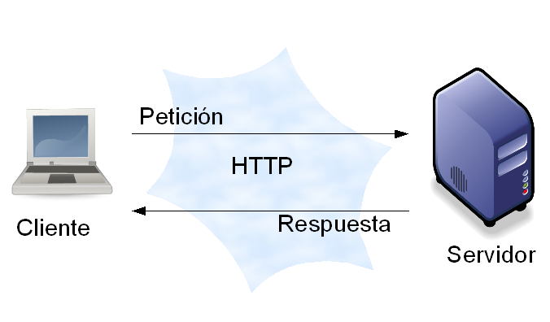

# Internet

## Índice de contenidos
|Internet|
|---
|[¿Que proporciona internet?](#que-proporciona-internet)
|[Estructura Cliente/Servidor](#estructura-clienteservidor)
|[Ingeniería del lado del cliente](#ingeniería-del-lado-del-cliente)
|[Ingeniería del lado del servidor](#ingeniería-del-lado-del-servidor)

## RECUERDA
> - Internet proporciona un medio para el desarrollo empresarial, basado en lo que se conoce como comercio electrónico o ecomerce (electronic commerce en ingles) que consiste en la compra y venta de productos y/o servicios a través de medios
    electrónicos
> - Desde que se puso de moda la utilización de Internet en casa de manera frecuente y debido a la comodidad que esto ofrece
    el cliente, cada vez es más fácil realizar trámites de esta manera, dando gran importancia a Internet.
> - Como ya hemos comentado, existe también lo que se llama programación del lado del servidor, en el cual nos encontraremos
    distintas tecnologías que nos permiten ejecutar aplicaciones en la parte servidora, es decir, en aquellos computadores donde
    están publicadas las páginas web.
>
### ¿Que proporciona internet?
Proporciona un medio para el desarrollo empresarial, basado en lo que se conoce como comercio electrónico o ecomerce, que 
consiste en la compra y venta de productos y/o servicios a través de medios electrónicos, pasando de ver la página web como una 
especie de escaparate donde empresas y partículas anuncian lo que ofrecen accediendo así a millones de clientes.

Incluso existen empresas dedicadas exclusivamente a la compra/venta, las cuales no tienen ni situación física. Por tanto, 
y como respuesta a ello, la tecnología informática asociada a las páginas web se ha visto aumentada, aumentando no solo su 
contenido sino también sus formas de añadir interactividad y de crear aplicaciones.

También cada día son más utilizadas en las denominadas intranets empresariales que utilizan una red de ordenadores privados 
con internet para compartir dentro de una organización parte de sus sistemas de información y sistemas operaciones.

[Ir al indice](#top)

### Estructura Cliente/Servidor
En las páginas webs existen en un entorno cliente/servidor donde:

1. El cliente, encargado de solicitar y mostrar al usuario las páginas webs.

2. El servidor, encargado de ofrecer las páginas webs a Cliente. 

  

[Ir al indice](#top)

#### Ingeniería del lado del cliente 
Es aquella que es ejecutada por la aplicación cliente, es decir principalmente por el navegador. Una aplicación puede tener esta 
estructura, con el objetivo de conseguir páginas interactivas, superando así las limitaciones de HTML.

Para ello se utiliza los “Lenguajes de Guiones o de Script” como por ejemplo JavaScript cuyo principal objetivo es realizar 
diversas tareas como combinar componentes, interactuar con el sistema operativo o con el usuario.

Se dice que JavaScript es un lenguaje de guiones ya que escribiremos el código directamente en el fichero HTML, soliendo ser
pequeños fragmentos de código junto al resto del código de la página web. Algunos ejemplos de cosas que podemos hacer como JavaScript será:

- Presentar un texto móvil en la barra de estado del navegador
- Obtener fecha y hora del ordenador del usuario.
- Obtener información del navegador.
- Modificar dinámicamente el tamaño de una imagen en una página web.
- Validar entradas compradas por internet.
- Etc.

[Ir al indice](#top)

#### Ingeniería del lado del servidor 
En la programación del lado del servidor nos encontraremos distintas tecnologías que nos permiten ejecutar aplicaciones en 
la parte servidora, es decir, en aquellos computadores donde están publicadas las páginas web. A estos servidores se les 
denomina servidores web o servidores HTTP y a las aplicaciones desarrolladas en la parte servidora se les conocen como aplicaciones web.

Este tipo de aplicaciones pueden ser de diversa naturaleza, como por ejemplo:

- Aplicaciones para acceder a bases de datos.
- Aplicaciones para acceder al sistema de ficheros.
- Aplicaciones que proporcionan diversas páginas web dependiendo del usuario que las solicite.
- Etc.

Para programar en estas aplicaciones necesitaremos conocer algunas tecnologías como por ejemplo:

- Microsoft ASP (Active Server Pages).
- ASP .NET.
- PHP.
- ColdFusion.
- JSP.

Por tanto, llegará el momento en el que debamos decidirnos por una de estas tecnologías, pero hay que tener cuidado ya que de
esto dependerá la base de datos utilizada, el servidor web y muchos otros factores. No todas las combinaciones son posibles.

[Ir al indice](#top)
