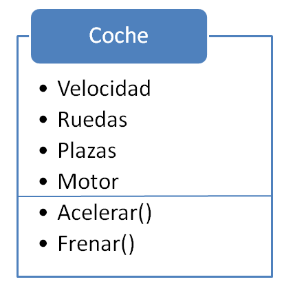
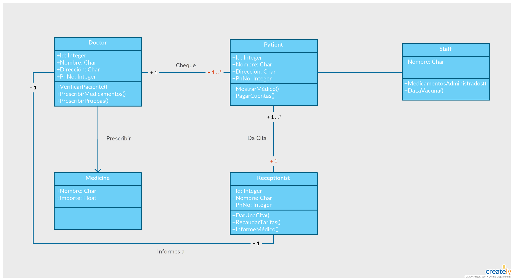
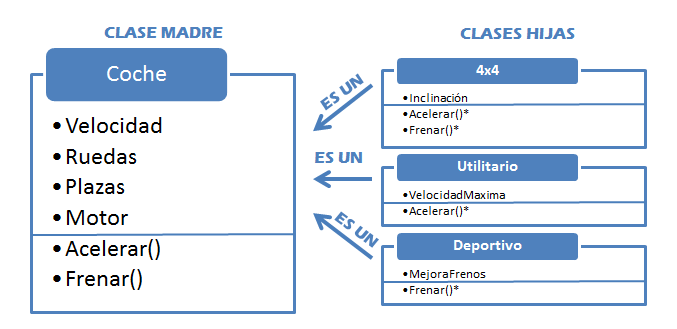
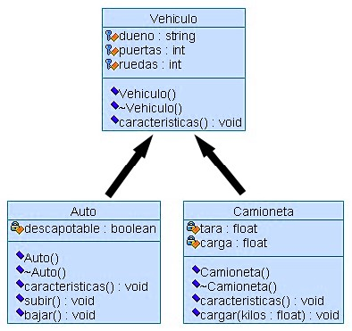
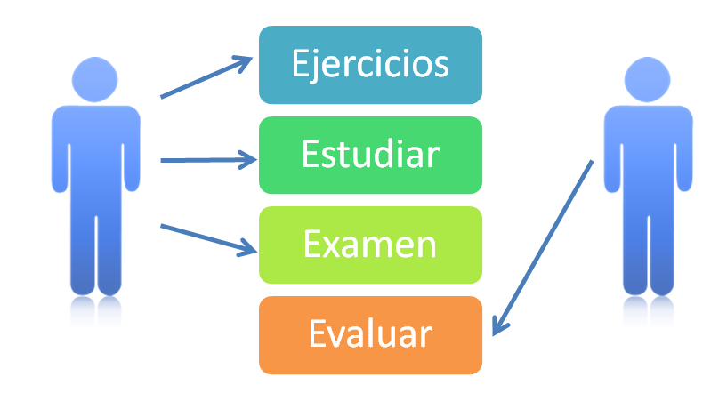
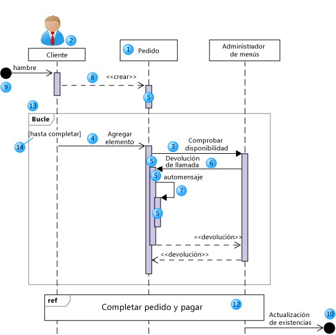
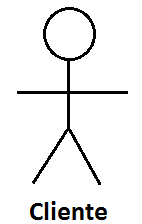

# Programción orientada a objetos

<a name="top"></a>
## Índice de contenidos
|[OOP](#oop)|
|---
|[Comportamiento de un objeto](#comportamiento-de-un-objeto)
|[Diagrama de clases](#diagrama-de-clases)
|[Métodos constructores](#métodos-constructores)
|[Atributos y métodos](#atributos-y-métodos)
|[Encapsulamiento](#encapsulamiento)
|[Herencia](#herencia)
|[Análisis orientado a objetos (UML)](#análisis-orientado-a-objetos-UML)
|[Actores en UML](#actores-en-uml)
|[Estereotipos UML](#estereotipos-uml)

## RECUERDA
> - En la programación orientada a objetos, el sistema se divide en objetos o entidades que podemos encontrar en la realidad.
> - Por protección de nuestros objetos, no es convenientemente que sus datos miembros o estado, sean accesibles de cualquier 
> forma y en cualquier momento.
> - El comportamiento de un objeto viene definido por la serie de procedimientos o funciones que definimos éste puede desarrollar.
> - El UML surge de la necesidad de un lenguaje que no sólo comunique las ideas a otros desarrolladores, sino para que también 
> sirviera de apoyo a la hora de analizar los distintos problemas que surgen a lo largo de la fase de desarrollo de un proyecto software. 
> - Los métodos constructores son un tipo de específico de método que siempre tiene el mismo nombre de la clase y se utiliza para 
> construir objetos de esa clase. Los métodos destructores se encargan de liberar la memoria de los objetos.
> - En UML todos los actores deben tener nombres de acuerdo al rol asumido. Por ejemplo unos nombres de actores podrían ser:
    Cliente web, Empleado, Pasajero, etc…
>
## OOP
En la programación orientada a objetos, el sistema se divide en objetos o entidades que podemos encontrar en la realidad.

Veamos un ejemplo. Imagine que está realizando la simulación de un coche, hablaría de: El coche dispone de un motor que se 
puede arrancar y apagar utilizando para ello el contacto.

Además, el coche dispone de un volante que permite que nos desplacemos en una determinada dirección: derecha o izquierda.
Al aumentar la velocidad utilizando el acelerador, debemos cambiar a una marcha más alta. Si reducimos la velocidad con el freno,
puede que sea conveniente cambiar a una marcha inferior...

En la descomposición en objetos nos hemos centrado en qué elementos podemos encontrar: motor, volante, acelerador, freno, caja de
cambios, etc.
Al pensar en objetos en lugar de en funciones, usted se acerca más a la realidad, ya que es la forma en que lo haría en cualquier
otra situación cotidiana.
De esta forma, una vez encontrados los objetos que intervienen, podremos asignarles las tareas que tienen que realizar

[Ir al indice](#top)

### Comportamiento de un objeto
El comportamiento de un objeto viene definido por la serie de procedimientos o funciones que definimos y éste puede desarrollar

Estos métodos, que también definimos nosotros, son operaciones que se pueden realizar con el objeto. Si en un objeto coche
tenemos los métodos Acelerar y Frenar, que aumentan o disminuyen el valor de la variable Velocidad, estos procedimientos
constituyen el comportamiento del objeto coche.

La identidad, como en cualquier otra variable, no es más que el identificador. Cuando definimos “cómo” es un objeto, después
podemos crear ese tipo de objetos. Si ya hemos definido nuestro objeto coche, podemos declarar diferentes instancias de este 
objeto, como coche01, coche02, etc. Cada vez que queramos acceder a cualquiera de los métodos o atributos, lo haremos
llamando al objeto por el identificador correspondiente.

El elemento que conforma la definición de un objeto recibe el nombre de Clase. Una clase no es otra cosa que una plantilla para
la creación de objetos, según un modelo que definamos. Las clases nos permiten abstracción sobre los datos y las operaciones
asociadas al objeto. A continuación explicaremos más extensamente el concepto de abstracción.

  

[Ir al indice](#top)

### Diagrama de clases
Sirve para visualizar las relaciones entre las clases que involucran el sistema, las cuales pueden ser asociativas, de herencia, 
de uso y de contenimiento. Una vez creada la clase diagrama podemos empezar a crear elementos: clases, etc… en ella.

 

[Ir al indice](#top)

### Métodos constructores
Son un tipo específico de método que siempre tiene el mismo nombre de la clase y se utiliza para construir objetos de esa clase.

No tiene tipo de dato específico de retorno, ni siquiera void. Esto se debe a que el tipo que debe devolver un constructor de clase
es el propio tipo de clase.

Los constructores pueden sobrecargarse. Si el programador no declara un constructor el sistema siempre crea un constructor por defecto.

Para inicializar un objeto basta con llamar a su constructor después de la palabra reservada new y asignarlo a una referencia
declarada previamente. Ejemplo:
```` 
$ejem = new Contructor()
```` 
Un constructor es un método que se ejecuta cada vez que se crea un objeto, el propósito de este procedimiento es el de inicializar 
los datos del objeto. El nombre del constructor siempre es igual al nombre de la clase.

Los métodos destructores se encargan de liberar la memoria de los objetos. En alguno lenguajes como Java no existen métodos
destructores ya que es el propio sistema el que se encarga de liberar la memoria de los objetos que ya han perdido la referencia,
es decir, objetos que ya no tienen ningún nombre que permita acceder a ellos. Al llegar al final de un bloque en el que habían sido
definidos, porque a la referencia se le ha asignado el valor null o porque a la referencia se le ha asignado la dirección de otro
objeto.

[Ir al indice](#top)

### Atributos y métodos
- Los atributos son los datos que hacen referencia al estado de un objeto, o lo que es lo mismo, a las variables que lo pueden 
componer. Los objetos pueden contener cualquier número de atributos, según las necesidades que tengamos al crearlo.

- Los métodos son las diferentes funciones que pueden aplicarse desde el objeto, en el caso del ejemplo sería Acelerar y Frenar. 
Pueden o no modificar los atributos de la clase, según lo definamos. Diferentes procedimientos pueden formar parte de nuestro 
objeto, devolviendo valores, leyendo o modificando atributos, etc.

[Ir al indice](#top)

### Encapsulamiento
Por protección de nuestros objetos, no es conveniente que sus datos miembro o estado, sean accesibles de cualquier forma y en
cualquier momento. Para evitar esto, se procede al encapsulamiento, que protege los datos asociados de un objeto contra su
modificación por quien no tenga derecho a acceder a ellos, previniendo posibles problemas posteriores por usos indebidos o no
autorizados.

La encapsulación va de la mano de la abstracción, ya que parte de la finalidad del encapsulamiento también es el 
conocimiento innecesario del usuario del cómo y porqué funciona un objeto, limitándose a usarlo.

No es necesario que el usuario de un objeto sepa cómo está estructurado por dentro. Los niveles de encapsulamiento nos
proporcionan tres distintos niveles de acceso a los datos de un objeto o clase, que son los siguientes:

- Público: es el nivel de protección más bajo y permite el acceso de cualquier función a los datos miembro de la clase

- Protegido: el acceso a estos datos está restringido a esta clase y a sus subclases (Ver punto HERENCIA).

- Privado: es el nivel más alto de protección. Sólo los métodos de esta clase en particular podrán tener acceso a los datos.

[Ir al indice](#top)

### Herencia
Cuanto más especializada es la clase, mayor nivel de abstracción conlleva mientras que, al revés, cuanto más vayamos hacia el
origen de la herencia, más general es, y por tanto, menos abstracta.

Esta relación se consigue gracias a la herencia, que como ya explicamos, se produce cuando aprovechamos la estructura de
clases ya existentes para crear clases nuevas basadas en esta, las cuales contienen todos los atributos y métodos de la clase
superior de la que proceden, lo que posibilita crear nuevas clases con nuevos matices que las diferencien entre sí, pero también
con nuevos métodos que se apliquen a los atributos y métodos heredados.

 

A las clases que sólo existen con la finalidad de agrupar y abstraer atributos y métodos comunes entre clases, se las conoce
como clases abstractas, mientras que a las clases que sí serán instanciadas, se las conoce como clases.

En UML existen 4 especificaciones en lo que a la herencia y sus subclases se refiere:

- {incomplete} indica que el conjunto de subclases no cubre todos los escenarios posibles de la clase madre. En nuestro
ejemplo, la herencia sería de este tipo, ya que existen más tipos de coches aparte del 4X4,el deportivo y el utilitario.

- {complete} indica que el conjunto de subclases cubre todas las posibilidades de escenario de la clase madre.

- {disjoint} nos indica que las subclases no tienen instancias comunes. Por ejemplo, aunque un Coche y un Helicóptero son
ambos Vehículos, no existe uno vehículo que sea ambos a la vez.

- {overlapping} nos indica que, al contrario que disjoint, tenemos una o varias instancias en comun entre las subclases. En
nuestro ejemplo, tambíen serían de este tipo, ya que hoy en día existen vehículos que pueden ser considerados a la vez
utilitarios y 4x4 por ejemplo.

En el caso que acabamos de mencionar, un vehículo SUV es a la vez Utilitario y 4X4, lo que hace que tenga herencia múltiple y,
a la vez, un conflicto, ya que el método Acelerar() lo tiene definido dos veces.

En el caso que acabamos de mencionar, un vehículo SUV es a la vez Utilitario y 4X4, lo que hace que tenga herencia múltiple y,
a la vez, un conflicto, ya que el método Acelerar() lo tiene definido dos veces.

[Ir al indice](#top)

### Análisis orientado a objetos (UML)
[UML](https://github.com/balta15torres/Mis-Notas/blob/master/cursoIngenieriaSoftware/Metodologi%CC%81as%20de%20desarrollo/index.md#lenguaje-uml) 
tiene unos objetivos básicos a cumplir. Debe permitirnos expresar un sistema de forma gráfica que facilite su comprensión
por parte de otros, así como poder especificar las características del sistema. A partir de un modelo UML, debemos poder construir
el sistema diseñado, modelos los cuales pueden servir como documentación.

Al ser un sistema de modelos, UML también nos permite, por ejemplo, diseñar flujos de trabajo. Los elementos clave de UML son
los conocidos como Bloques de construcción, entre los que distinguimos:

- Elementos: son abstracciones de cosas reales o ficticias

- Relaciones: relacionan los elementos entre si

- Diagramas: son colecciones de los dos anteriores

Los diagramas merecen especial mención, ya que finalmente son los elementos que nos van a permitir comprender el sistema. 
Existen diferentes tipos de diagramas: Diagrama de secuencia: representa la interacción entre los diferentes objetos que 
componen el sistema.

- Diagrama de clases: representa un conjunto de clases y sus relaciones. Es el más habitual para describir el diseño de 
sistemas orientados a objetos.

 

- Diagrama de casos de uso: los casos de uso son supuestos con el sistema a desarrollar, lo que debe hacer un sistema y cómo.

 

- Diagrama de secuencia: representa la interacción entre los diferentes objetos que componen el sistema.

 

[Ir al indice](#top)

### Actores en UML
Un actor en UML es definido como un rol de usuario que interactúa con el sistema mediante un caso de uso. Debemos de saber
que la palabra rol no identifica necesariamente a una persona en particular, si no que identifica una labor que se realiza frente al
sistema. Por eso estos actores pueden ser personas reales (empleados, usuarios), otros equipos o un evento externo.

Los actores pueden ser clasificados en varios tipos según sus funciones en el sistema:

- Primarios: son actores que explotan la funcionalidad del sistema, interactuando y trabajando frecuentemente y cuya actividad
resulta esencial para el mismo. Por lo general, estos actores siempre necesitarán un caso de uso.

- Secundarios: son actores que, aunque no explotan directamente el sistema con funciones esenciales, son necesarios para que
los primarios puedan hacerlo. Generalmente, estos actores, aunque están implicados en casos de uso, no son beneficiarios de
las acciones de ninguno.

Diversos autores consideran la existencia o clasificación de otros posibles actores que no aparece en UML, como por ejemplo los
iniciadores, que se definen como actores que sólo sirven para desencadenar tareas.

> La representación gráfica de los actores se realiza mediante el “Stick Man” o icono de hombre, este icono contiene el nombre del
  actor. El nombre de los actores deben seguir las directrices en función del tipo de clase. Los nombres de los actores abstractos
  deben de ir en letra cursiva.

 

[Ir al indice](#top)

### Estereotipos UML
Con la finalidad de proporcionar información adicional para los desarrolladores o la máquina, se pueden agregar perfiles que
permiten extender el UML para crear nuevos modelos de elementos, derivados de elementos existentes, pero con propiedades
específicas que sirvan para un problema particular o un uso concreto. A esto se le llama estereotipo. Por ejemplo, cuando
modelamos una red, necesitamos tener símbolos que representen routers y hubs.

Un estereotipo no puede ser usado por si solo, sino que siempre debe ir acompañado de una clase de las que se extiende. No
pueden expresarse estereotipos entre sí. Usan la misma notación que una clase, pero con la palabra clave <> mostrada encima del
nombre. Con los estereotipos, podemos cambiar la apariencia gráfica de un elemento de modelo extendido, usando iconos
representados en el perfil de clase Image. Como un estereotipo es una clase, puede tener propiedades, a las que nos referiremos
como etiquetas de definición. Cuando se aplica un estereotipo a un modelo de elemento, nos referimos a los valores de las
propiedades como valores etiquetados.

En esencia, un estereotipo representa una distinción en su uso, pudiendo ser aplicado sobre cualquier elemento modelado, como
clases, paquetes, herencias, etc. Se modela una clase patrón con un estereotipo paramétrico, lo que significa que puede contener
parámetros.

[Ir al indice](#top)
