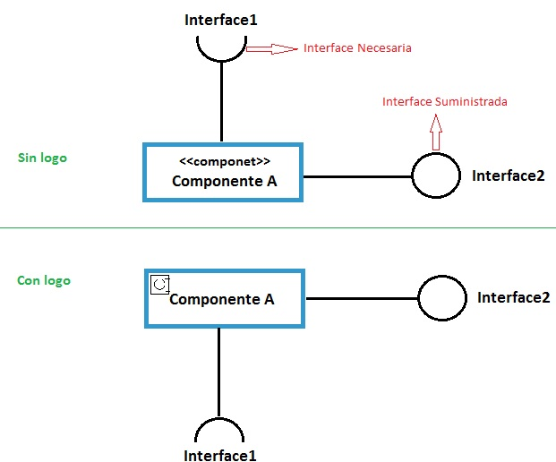
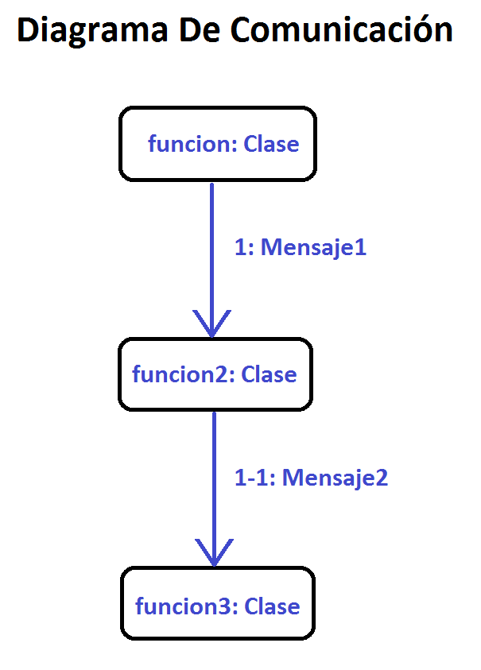
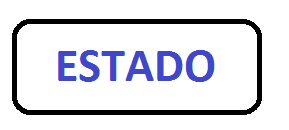
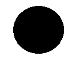
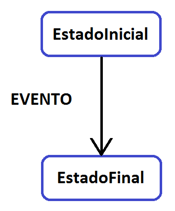
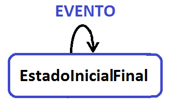
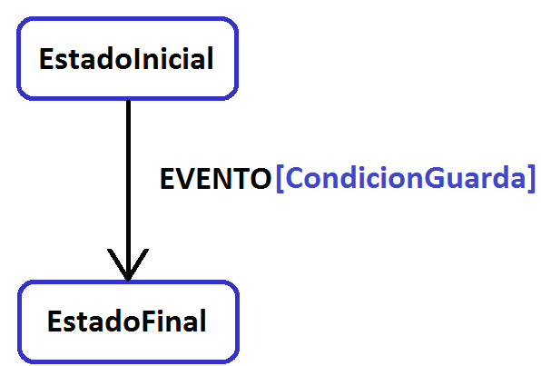

# Técnicas de diseño orientado a objetos (UML) 

## Índice de contenidos
|Técnicas de diseño orientado a objetos (UML)|
|---
|[Reglas para el diseño de los diagramas de uso](#reglas-para-el-diseño-de-los-diagramas-de-uso)
|[Componente](#componente)
|[Diagrama de despliegue](#diagrama-de-despliegue)
|[Diagrama de comunicación](#diagrama-de-comunicación)
|[Diagrama de estados-transiciones](#diagrama-de-estados-transiciones)

### Reglas para el diseño de los diagramas de uso
Algunas reglas para el diseño de los diagramas de uso son:

- Mantener todos los casos de uso de un diagrama ala mismo nivel de abstracción.

- Mantener el diagrama ordenado.

- Evitar tener demasiados casos de uso en el mismo diagrama.

- Evitar el uso complejo de relaciones de extensión especialización e inclusión.

Un diagrama de casos de uso esta compuesto por los elementos que se muestran a continuación:

- Casos de uso.

- Relaciones de uso.

- Actor.

- Escenarios.

En definitiva. Un diagrama de casos de uso representa un esbozo general de un proceso y sus diferentes pasos, para facilitar su
comprensión y, por tanto, su desarrollo en el proyecto, constituyendo un lenguaje gráfico sencillo y modulable.

[Ir al indice](#top)

### Componente 
El componente es una unidad software que aporta una serie de servicios mediante una o varias interfaces. En otras palabras se
puede definir como una caja negra cuyo contenido no interesa a los clientes. Los componentes están totalmente encapsulados.

Los componentes pueden depender de otros componentes para realizar operaciones internas. En este caso los componentes que
dependen de otros, pasan a ser clientes. Al ser clientes estos componentes no conocen la estructura interna. Con lo que dependen
solo de las interfaces de dichos clientes. Dichas interfaces se les denominan con el nombre de interfaces necesarias del
componente cliente. Las interfaces que determinan los servicios que ofrece un componente se denominan interfaces suministradas.

Las interfaces suministradas se representan con un círculo, mientras que las interfaces necesarias se representan mediante un
semicírculo. La notación gráfica de los componentes es dentro de un rectángulo con el estereotipo <>, el estereotipo puede ser
sustituido por el logo del componente.

  

[Ir al indice](#top)

### Diagrama de despliegue
El diagrama de despliegue describe la arquitectura física del sistema. Está compuesto de nodos. Un nodo es una unidad material
capaz de recibir y de ejecutar software. La mayoría de nodos son ordenadores. Los vínculos físicos entre nodos también pueden
describirse en el diagrama de despliegue, corresponden a las ramas de la red.

Los nodos contienen software en su forma física, conocida como artefact. Los archivos ejecutables, las bibliotecas compartidas y
los scripts son ejemplos de formas físicas de software.

Los componentes que constituyen la arquitectura del software del sistema se representan en el diagrama de despliegue mediante
un artefacto que, con frecuencia, es un ejecutable o una biblioteca compartida.

[Ir al indice](#top)

### Diagrama de comunicación
El diagrama de comunicación es también conocido o denominado con el nombre de diagrama de colaboración. Es un diagrama de
interacción el cual muestra una información parecida al diagrama de secuencia, la única diferencia es que se basa principalmente
en la relación de los objetos.

El diagrama de comunicación modela las interacciones entre objetos o mensajes. Además representan un conjunto de información 
tomada desde el diagrama de clases, secuencia y diagrama de casos de uso describiendo la estructura estática y el comportamiento 
dinámico del sistema.

  

El diseño de los diagramas de comunicación no tiene un formato especifico, es decir, se pueden orientar o determinar los objetos
en aquella posición en la que destaquen más sus relaciones. Antes de generar los mensajes se recomienda generar todos los
objetos que intervienen en la interacción y posicionarlos de forma lógica. Generalmente, un diagrama de comunicación representa
una instancia o un trazado de ejecución del programa.

Para mantener el orden de los mensajes en un diagrama de comunicación, los mensajes son etiquetados con un número
cronológico y colocado cerca del enlace por el cual se desplaza el mensaje.

[Ir al indice](#top)

### Diagrama de estados-transiciones
Mediante un diagrama de estados-transiciones especificamos el ciclo de vida correspondiente a las instancias de una clase,
representando además los estados, las transiciones vinculadas y aquellos eventos que generan un traspaso de transiciones.

La utilidad de este tipo de diagramas es muy concreta: son para los objetos que tiene un ciclo de vida determinado. Por lo
contrario resultaría inútil crear un diagrama de estados-transiciones, a aquellos objetos que solo transmiten información y no
cambian de estado.

El estado es representado gráficamente mediante un rectángulo con esquinas redondeadas y el nombre en el interior.

 

El estado inicial es representado mediante un punto negro.

 

La representación del estado final se realiza mediante un punto negro, dentro de un círculo

 

La transición es representada por una flecha la cual une el estado final e inicial.

Transición Reflexiva
 
 

A veces es necesario asociar condiciones a una transición en particular, las cuales es preciso que se cumplan. Dichas condiciones 
son conocidas con el nombre de condiciones de guarda. Estas condiciones se representan entre corchetes, si la transición 
contiene un evento asociado, las condiciones se ubicaran a la derecha del nombre del evento:

 

Además de condiciones de guarda, un estado o traspaso de una transición puede contener actividades vinculadas. Definimos una
actividad como un conjunto de acciones que cumplen un propósito concreto. Dichas acciones consisten en determinar un valor a un
atributo, crear o eliminar objetos, realizar una operación, enviar señales a otros objetos, etc…

Podemos clasificar generalmente las actividades en los siguientes tipos:

- Actividades intrínsecas al estado, ante la recepción de un nuevo evento

- Actividades que se lanzan durante la entrada o salida del estado.

- Actividades que deben tener lugar durante el estado

- Actividades que ocurren durante el traspaso de una transición.

- En función de la palabra que preceda a la actividad, esta realizara unas determinadas acciones:

- Actividades con la palabra entry/: se ejecuta a la entrada de un estado.

- Actividades con el nombre de un evento: se ejecutan si se ha recibido un evento.

- Actividades con la palabra do/: añade la actividad realizada durante el estado.

- Actividades con la palabra exit/: se ejecutan en la salida del estado.

[Ir al indice](#top)

