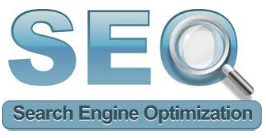
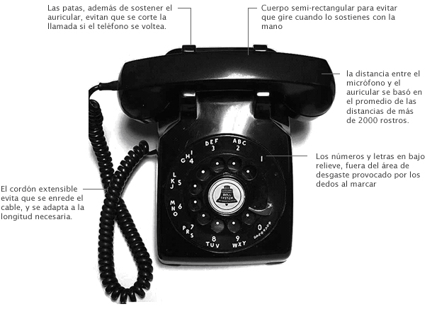
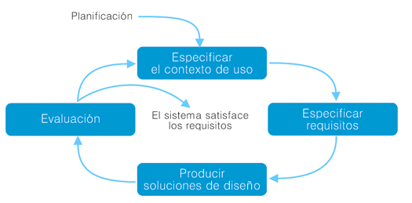

# Usabilidad Web

## Índice de contenidos
|Usabilidad Web|
|---
|[Concepto de usabilidad](#concepto-de-usabilidad)
|[Los pilares de la usabilidad](#los-pilares-de-la-usabilidad)
|[Posicionamiento Web y usabilidad](#posicionamiento-web-y-usabilidad)
|[Diseño centrado en el Usuario](#diseño-centrado-en-el-usuario)
|[Objetivo del diseño centrado en el Usuario](#objetivo-del-diseño-centrado-en-el-usuario)
|[Interacción persona-ordenador](#interacción-persona---ordenador)
|[Accesibilidad y usabilidad](#accesibilidad-y-usabilidad)
|[Usabilidad y analítica Web](#usabilidad-y-analítica-web)

### Concepto de usabilidad
La usabilidad, en un amplio sentido de la palabra, está referida a la facilidad y manejabilidad con las que los seres humanos
pueden interactuar con cualquier objeto u herramienta. En este caso, está referida a sitios web, para que se haga un diseño y una
programación de sitios Web que haga los sitios web intuitivos y fáciles de usar por el usuario.

Esta es una definición para usabilidad pero existen multitud de ellas, la [Organización Internacional para la Estandarización (ISO)](https://github.com/balta15torres/Mis-Notas/blob/master/cursoIngenieriaSoftware/Metodolog%C3%ADas%20de%20desarrollo/index.md#isoiecieee-12207)
ofrece una definición general de usabilidad: "grado de eficacia, eficiencia y satisfacción con la que usuarios específicos pueden
lograr objetivos específicos, en un contexto de uso específico."

La arquitectura de la información (AI) es una filosofía por medio de la cual es estudiado cómo se organiza la información de tal
forma que los usuarios pueden localizarla y trabajar con ella. La organización se basa en estructurar, clasificar y rotular la
información de la Web.

La arquitectura y la usabilidad están íntimamente ligadas. Esta correcta arquitectura de la información por medio de la cual 
se consigue que el usuario encuentre la información adecuadamente a través de:

- Con la vista: contenido, menú, enlaces.

- Un buscador: es muy útil para encontrar la información entre una gran cantidad.

[Ir al indice](#top)

### Los pilares de la usabilidad
- Rápido: las páginas que vayan a servir no deben tardar más de 4 segundos en cargar siempre que nuestro visitante tenga una
conexión adecuada. Si las páginas tardan más de lo normal en cargar el usuario deberá esperar demasiado y por lo tanto podemos
perder al visitante.

- Simple: debemos mantener unos elementos comunes en todas las páginas para que la Web se pueda navegar de forma
constante y el usuario no se pierda en ningún momento. La animaciones pueden ser atractivas pero continuas distraen y cansan al
usuario.

- Legible: La página Web debe tener contenido escrito y no exclusivamente animaciones, debemos evitar Flash. De esta forma los
motores de búsqueda podrán leer y categorizar nuestra Web para poder posicionarla correctamente.

- Accesible: Para todos los navegadores: Los sitios Web deben mostrarse correctamente en la mayoría de los navegadores
actuales.

- Actualización: Para que una Web nunca quede anticuada y pierda credibilidad actualícela.

[Ir al indice](#top)

### Posicionamiento Web y usabilidad
Tener hoy en día un sitio web que no aparezca entre los resultados que devuelve un buscador (Google copa la mayoría de las
consultas que se hacen en Internet) al realizar una consulta sobre contenidos como los de nuestro sitio web significa que
prácticamente nuestro sitio no servirá para nada, ya que sólo servirá para mostrarle información a la gente que ya la conozca. Por
tanto, es fundamental que nuestro sitio aparezca entre los primeros resultados que devuelve un buscador al hacer una consulta.
Hacer que esto ocurra es lo que conocemos como posicionamiento web, que constará de un conjunto de tareas y políticas a seguir
desde la propia creación del sitio web hasta su mantenimiento diario, haciendo que su contenido sea destacable para los
buscadores, y por tanto aparezca en las primeras posiciones de una búsqueda cuando los términos clave de la búsqueda estén
relacionados con los contenidos.

Lógicamente, todo estará relacionado con la búsqueda que se realice, porque, por ejemplo, si nuestro sitio está dedicado a la
venta on-line de ropa. No tendría sentido que nos esforzáramos es que apareciera en la primera posición cuando se haga una
búsqueda con los términos clave: “coches” o “muebles”. Por tanto, una de las principales tareas que tendremos que pensar muy
bien será la elección de las palabras clave para poder posicionar nuestro sitio Web, en nuestro ejemplo, parece lógico pensar que
palabras que deberíamos usar serían: “ropa” y “on-line” y que deberían estar en partes importantes y principales de nuestro sitio
web para que sean fáciles de localizar.

  

La siguiente cuestión que nos planteamos es la de estudiar la relación entre el posicionamiento y la usabilidad. Pues la relación
se sigue basando en lo fácil que sea de localizar la información, nuestro sitio web, dentro de la inmensa cantidad de sitios web que
hay en Internet. Es decir, un sitio web será accesible si es fácil de localizar, y será fácil de localizar si aparece en las primeras
posiciones de los buscadores.

Por tanto, debemos pensar desde el punto de vista del usuario y valorar la facilidad que tenga para encontrar y acceder a
nuestro sitio web cuando haga alguna búsqueda usando los principales buscadores como Google o Yahoo!.

[Ir al indice](#top)

### Diseño centrado en el Usuario
El Diseño Centrado en el Usuario es el que está definido por la información aportada por las personas que van a hacer uso del
producto.

Es una nueva manera de enfocar el diseño, donde la utilidad no estaba reñida con el placer de uso, y la necesidad se convierte
en el contrapunto para ofrecer nuevas técnicas y métodos de trabajo.

En la década de los ochenta comienza la plena expansión del diseño centrado en el usuario. Norman, profesor de la Northwestern 
University y cofundador de Nielsen Norman Group, fue quien comenzó a utilizar el término User Centered System Design (Diseño Centrado en el Usuario)

Se utilizó como marco de trabajo, investigación y desarrollo de principios del diseño de interfaces de usuario. Era el 
momento de observar cómo la gente usaba los sistemas y creaba sus propios modelos mentales a partir de los procesos de 
interacción. Tres fueron los términos que debían ser valorados para entender estos procesos:

- El modelo conceptual: Ofrecido por el diseñador del sistema.

- Interfaz: La imagen que el sistema presenta al usuario.

- El modelo mental: Desarrollado por el usuario a partir de la imagen.

De este modo, el enfoque del Diseño Centrado en el Usuario persigue asegurar la consecución de un producto con la funcionalidad 
adecuada para usuarios concretos.

> Henry Dreyfuss, autor del libro Designing for people (1955) popularizó la concepción del diseño como proceso a partir de sus
  diseños de teléfonos de la serie 500 para Bell Telephones. Este diseñador industrial, pionero del diseño centrado en el usuario,
  estudió cómo se construían los teléfonos, cómo se percibían y eran utilizados por las personas. Sus conclusiones fueron aplicadas a
  un nuevo diseño donde se corregían aspectos como la forma, el tamaño, las proporciones o el color.

  

[Ir al indice](#top)

#### Objetivo del diseño centrado en el Usuario
El objetivo de esta filosofía es ofrecer respuesta a preguntas como ¿quién usará este sistema?, ¿qué es lo que va a hacer con él? 
ó ¿qué información necesitará para alcanzar sus objetivos?. 

El Diseño Centrado en el Usuario es un proceso cíclico en el que las decisiones de diseño están dirigidas por el usuario y los
objetivos que pretende satisfacer el producto, y donde la usabilidad del diseño es evaluada de forma iterativa y mejorada
incrementalmente.

De acuerdo a la norma [ISO 13407](https://www.nachomadrid.com/2020/04/diseno-centrado-usuario/#:~:text=En%20el%20a%C3%B1o%201999%20se,persona%20o%20humano%20(human).), 
podemos desgranar este proceso en cuatro fases:

- Entender y especificar el contexto de uso: Identificar a las personas a las que se dirige el producto, para qué lo usarán y en
qué condiciones.

- Especificar requisitos: Identificar los objetivos del usuario y del proveedor del producto deberán satisfacerse.

- Producir soluciones de diseño: Esta fase se puede subdividir en diferentes etapas secuenciales, desde las primeras soluciones
conceptuales hasta la solución final de diseño.

- Evaluación: Es la fase más importante del proceso, en la que se validan las soluciones de diseño (el sistema satisface los
requisitos) o por el contrario se detectan problemas de usabilidad, normalmente a través de test con usuarios.

  

Diseñar centrándonos en el usuario no sólo implica entender cómo será usado el producto y evaluar las soluciones de diseño a
partir de los usuarios, sino también analizar el valor del producto que pretendemos crear, su capacidad para resolver necesidades
reales.

Es importante que el producto satisfaga necesidades del usuario, por lo que el primer paso para alcanzar una meta es tomar una
dirección de salida acertada. Si la concepción de un producto no parte de las necesidades reales e intereses de sus usuarios, poco
podrán aportar las siguientes etapas de desarrollo a la aceptación del producto por parte del usuario final. 

De este modo estamos presuponiendo que el motor de la conducta humana son las necesidades.

La forma de detectar y analizar las necesidades del usuario es a través de la observación, investigación e indagación del 
usuario: la actividad, el entorno y el contexto en los que tendría lugar el uso del producto.

Nuestro trabajo de observación debe centrarse en lo que la gente hace y en qué momentos no son eficaces o evidencian dificultades 
para alcanzar objetivos.

[Ir al indice](#top)

### Interacción persona-ordenador
La interacción persona-ordenador está muy relacionada con la usabilidad Web por intercambio de datos o información entre 
el ordenador y la persona.

Joseph Carl Robnett Licklider (11 de marzo de 1915 - 26 de junio de 1990), que podríamos considerar como uno de los padres de la 
informática en la era digital ya que tenía una visión más amplia del uso de los ordenadores desde su aparición, y más allá de verlos 
como simples máquinas de cálculo, él consideró que podrían inspirar la creatividad y compartir la información en un mundo 
globalizado como así ha sido. Así, en 1960, en su artículo llamado “Simbiosis hombre-ordenador” ya indicaba la necesidad de 
mejorar la interacción entre los ordenadores y los usuarios.

En 1962, junto con Welden Clark, publicaron el artículo "On-Line Man Computer Communication”, con una serie de cuestiones
que deberían resolverse para facilitar la comunicación entre las personas y los ordenadores. Algunas de estas cuestiones debían a
su juicio ser resueltas en un plazo corto de tiempo, como:

- Poder compartir el tiempo de uso de los ordenadores entre muchos usuarios.

- Disponer de un sistema de entrada-salida para la comunicación mediante datos simbólicos y gráficos.

- Hacer que un sistema interactivo procesara las operaciones en tiempo real.

- Mejorar la velocidad de recuperación de información en los sistemas de almacenamiento masivo de información.

- Facilitar la cooperación entre personas en el diseño y programación de grandes sistemas.

En un plazo intermedio de tiempo, consideraron que sería necesario que los ordenadores pudieran reconocer la voz, la escritura
manual impresa y permitieran la introducción de datos a partir de escritura manual directa.

Además plantearon otra serie de cuestiones para mejorar esta interacción entre personas y ordenadores en el futuro, como que
los ordenadores fueran capaces de comprender el lenguaje natural, sintáctica y semánticamente, además de reconocer la voz de
distintos usuarios. Además habría que centrarse en descubrir, desarrollar y simplificar la teoría de algoritmos y llevar a cabo una
programación heurística o a través de principios generales.

Otro autor que conviene destacar es Wilfred J. Hansen, que en su libro "User Engineering Principles for Interactive Systems"
publicado en 1971, enumera una serie de principios a tener en cuenta cuando se está haciendo el diseño de sistemas pensados
para la interacción entre el ordenador y las personas, como:

- Conocer al usuario para el que está destinado el sistema

- Evitar que el usuario tenga que hacer operaciones de memoria, sustituir las entradas de datos por la selección de ítems, usar
nombres en lugar de números o códigos, procurar que siempre haya un comportamiento predecible y proporcionar un acceso
rápido a la información.

- Optimizar el tiempo de ejecución de operaciones comunes, mejorar la consistencia de la interfaz y organizar la estructura de
la información basándose en la observación del uso del sistema.

- Proporcionar mensajes de error significativos, crear diseños que eviten los errores más comunes, hacer que sea posible
deshacer acciones realizadas, y garantizar la integridad del sistema en caso de un fallo de software o hardware.

[Ir al indice](#top)

### Accesibilidad y usabilidad
Denominamos a la accesibilidad como el grado o la facilidad con que todas las personas son capaces de acceder o de utilizar un
objeto, es decir, la usabilidad se centra en el uso y su facilidad de acceso a todas las personas.

La accesibilidad se encarga de que a un sitio Web puedan acceder todas las personas que quieran usarlo sin ningún tipo de
limitación, ya sea física o del entorno en el que se encuentre.

El World Wide Web Consortium (W3C), en español Consorcio World Wide Web, es una comunidad internacional que trabaja para
que haya unos estándares, pautas y protocolos a seguir y que garanticen el desarrollo y crecimiento de la Web a lo largo de los
próximos años. El fundador de W3C es Tim Berners-Lee y junto con el Director Ejecutivo, Jeffrey Jaffe, pretenden desarrollar todo
el potencial de la Web.

El W3C también se dedica a mejorar la accesibilidad. En este sentido, trabaja en la Web Accessibility Initiativa (WAI), o Iniciativa
de Accesibilidad Web. Pretende mejorar la accesibilidad Web, y además desarrollar pautas y herramientas tanto para la mejora de
la accesibilidad como de su evaluación, hace especial hincapié en la concienciación de la importancia que tiene hacer un diseño
accesible. También trata de encontrar opciones que mejoren la usabilidad.

[Ir al indice](#top)

### Usabilidad y analítica Web

#### ¿Qué es la analítica Web?
La analítica Web básicamente consiste en analizar, como su propio nombre indica, los datos más relevantes de los visitantes de
un sitio web para poder obtener conclusiones que mejoren el uso del sitio. Antes todo se hacía a través de los datos que se
almacenaban en los logs de los servidores, pero actualmente eso no es suficiente para poder obtener toda la información que se
requiere, así que se suele añadir al final de las páginas un poco de código javascript para recoger los datos que más nos interesen
y poder procesarlos posteriormente. 

La principal ventaja de esto es que podemos extraer información precisa, que nos ayude a medir y entender cómo se mueven 
los usuarios por nuestro sitio, también podremos clasificar o segmentar el tipo de usuarios que acceden a nuestro sitio web, 
pudiendo dirigirnos con más precisión a cada uno de ellos.

Las herramientas profesionales más populares para llevar a cabo la tarea de la analítica web son:
- Google Analytics

- Omniture SiteCatalyst

- XiTi

#### ¿Qué mide la analítica Web?
La analítica web puede abarcar un gran número de variables y datos que pueden ser tenidos en cuenta y que sean
personalizables para cada sitio web, porque no a todos los sitios web les interesa conocer los mismos datos sobre los visitantes o
usuarios del sitio. Sin embargo, hay una serie de medidas que son utilizadas de forma general por cualquier herramienta de
analítica, como por ejemplo:

- Número de páginas vistas

- Número de usuarios que han accedido

- Número de visitas que ha tenido una página

- Tiempo de navegación de los usuarios

Otros datos que suelen usarse en la analítica Web son:

- datos de clicks: mediante su análisis se puede construir un mapa de calor sobre una página, pudiendo observar a simple vista
los elementos que han tenido más clicks y averiguar las rutas que han seguido los usuarios.

- euros: podremos conocer el importe de los clics en anuncios o la muestra de banners. En un sitio de comercio electrónico
conoceríamos el valor de las ventas.

- orígenes del tráfico: para poder saber desde qué sitios Web vienen nuestros visitantes o qué términos clave han utilizado en
los buscadores para llegar hasta él.
páginas de entrada: puede que nos interese conocer desde qué página o sección, en el caso de que haya varias, de nuestro
sitio acceden los usuarios.

- páginas de salida: de la misma manera, pero para conocer desde qué página o sección abandonan nuestro sitio.

- abandono de formularios: se podrá analizar de esta manera cuantas veces un formulario que se empieza a rellenar es
abandonado, además de los campos que quedaron rellenos o los que quedaron en blanco.

- eventos del sitio Web: un variado número de eventos y acciones que también podrían analizarse, como por ejemplo, el
número de usuarios que realizan búsquedas en nuestro sitio, o que se dan de alta en un servicio para recibir noticias o
avisos, etc.

#### Analítica Web y Usabilidad
Existen muchas técnicas y procedimientos que nos permiten aprovechar los datos recolectados por una herramienta de analítica
Web a fin de mejorar la usabilidad de un sitio Web. Nos centraremos en los siguientes puntos:
 
##### ClickMap o “mapa de clicks”:
Podremos ver dónde hacen clic los usuarios, así a simple vista podemos ver como se mueven
los usuarios por nuestro sitio, es decir, en que partes hacen clic cuando se encuentra en una pantalla concreta. De esta manera
podremos analizar esta información y utilizarla para poder mejorar nuestro sitio:

- Mejorando la visibilidad y el posicionamiento de los enlaces y botones que necesitemos

- Evitando que haya elementos dentro de la página que confundan al usuario, como aquellas posibles zonas en los que se
registren muchos clicks sin ser elementos "clicables".

- Mejorando la visibilidad de los elementos de la página que sean más "rentables".

##### A/B Testing 
Se trata de una herramienta útil cuando se duda entre varios posibles diseños alternativos para una página web. En este caso, si
pusiésemos varias versiones en el servidor, podríamos utilizar una aplicación para analizar las versiones (como Omniture
SiteCatalyst o Google Optimizer) y poder comparar así los resultados para las dos versiones.

##### Análisis de formularios
Mediante el análisis de formularios, como se comentaba anteriormente, podremos medir, por ejemplo, el número de veces que
se abandona un formulario, en qué campo se abandona, etc. Esto nos dará información sobre si el formulario era demasiado
extenso, si los datos eran de carácter demasiado personal, etc.

##### Rutas de navegación
Los informes sobre las rutas de navegación que han seguido los usuarios (informes que nos proporcionan herramientas como
Omniture SiteCatalyst o Visual Sciences), son los elementos más potentes de las que disponemos para poder llevar a cabo la
analítica web. Haciendo uso de ellos podremos conocer las páginas por las que navegan los usuarios y el orden en el que lo hacen,
desde cuántos sitios se accede a una página determinada, qué rutas son las más populares o más seguidas, en un proceso de
registro de usuario o de rellenar un formulario cuántos usuarios abandonan y hacia dónde se dirigen cuando abandonan, etc. Con
toda esta información precisa y detallada habrá que tomar decisiones en busca de mejorar la usabilidad del sitio web.

[Ir al indice](#top)
